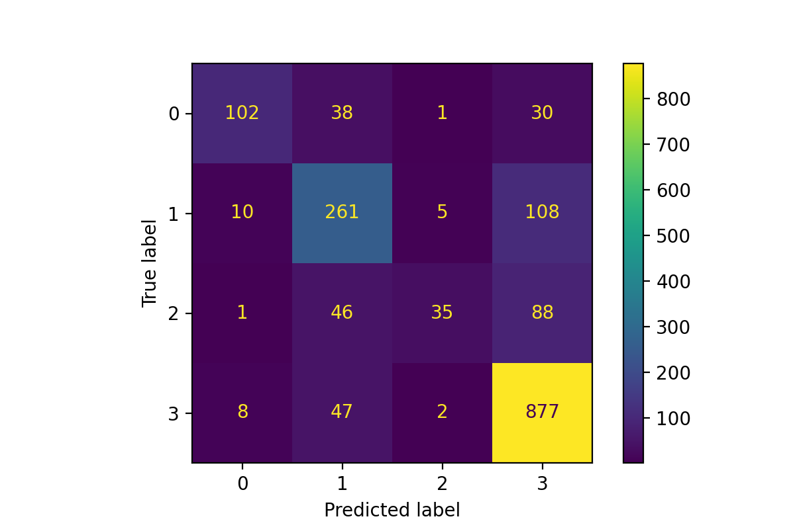

# Hackathon Solidaire 2022

Coding competition focused on gender inequalities in cinema.
Organized by [DataForGood](https://dataforgood.fr) and [Eleven](https://eleven-strategy.com)

This team was awarded the first place

### The team:
- Martin Alexandre  [][1]  [][2] 
- Camille Ballu[ ][3]  [][4] 
- Vincent Delale [][5]  [][6] 
- Thomas Kientz [][7]  [][8] 
- Alexandre Quéant [][9]
- Lucas Saban [][11]  [][12] 

[1]: https://www.linkedin.com/in/martin-alexandre-4b48511b4/
[2]: https://github.com/martinalex7

[3]: https://www.linkedin.com/in/camille-ballu/
[4]: https://github.com/cmllbll

[5]: https://www.linkedin.com/in/vincent-delale-a53141182/
[6]: https://github.com/vdelale

[7]: https://www.linkedin.com/in/kientzthomas/
[8]: https://github.com/thomktz

[9]: https://www.linkedin.com/in/alexandre-queant-b19b8521b/

[11]: https://www.linkedin.com/in/lucas-saban/
[12]: https://github.com/g0bel1n

### The goal:

Given basic data about a movie ([IMDb](https://www.imdb.com) id), determine whether it will pass the [Bechdel test](https://en.wikipedia.org/wiki/Bechdel_test).
The classes to predict are as such:

| **Level** |                      **Description**                      |
|-----------|:---------------------------------------------------------:|
| 0         |                    (None of the above)                    |
| 1         |        There are two women characters in the movie.       |
| 2         |                  They talk to each other.                 |
| 3         | They talk to each other about something other than a man. |

### The data:

- We gathered data from The Movie DataBase ([TMDB](https://www.themoviedb.org/?language=fr)) to get info about actors, producers, writers and such. 
- We used the movies' posters to determine the number of women on them and the relative size of women on the posters using [DeepFace](https://github.com/serengil/deepface). 
- We used audio recognition on youtube videos of the movies' trailers to get the proportion of women's speech in them.
- We used NLP on the movies' synopsis and PCA analysis to get insights from the plots.

### The model:

We used XGBoost and hyperparameters tuning in sklearn for the final model.

### Results:

Confusion matrix of the `XGBClassifier` on the test set (20% of the 8000+ movies):

Most relevant features:

| **Feature name** |                       **Description**                       | **Importance** |
|------------------|:-----------------------------------------------------------:|----------------|
| `PCA_0`          | First vector in the PCA of the NLP analysis of the synopsis |        0.05241 |
| `Is_War`         |         Dummy variable - Is the movie a war movie ?         |        0.04633 |
| `writers_female` |                   Number of female writers                  |        0.04234 |
| `cast_female`    |                   Number of female actors                   |        0.03934 |
| `area_women`     |       Proportional area of womens' faces in the poster      |        0.03709 |
| `Is_Horror`      |        Dummy variable - Is the movie a horror movie ?       |        0.03567 |
| `nb_women`       |                Number of women on the poster                |        0.02856 |
| `Is_Romance`     |       Dummy variable - Is the movie a romance movie ?       |        0.02456 |
| `cast_male`      |                    Number of male actors                    |        0.02075 |
